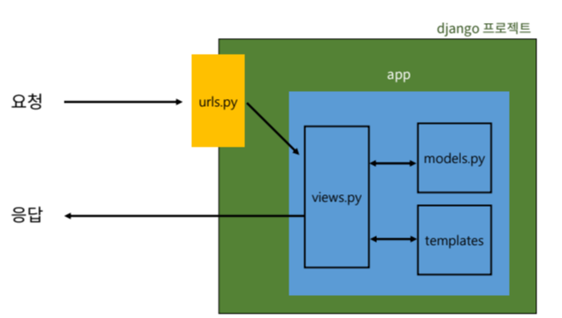

# 장고의 디자인 패턴

## 장고 프로젝트와 앱
### 프로젝트
애플리케이션의 집합 (DB설정, URL연결, 전체 앱 설정 처리)

### 어플리케이선
독립적으로 작동하는 기능 단위 모듈
(각자 특정한 기능을 담당하며 다른 앱들과 하나의 프로젝트를 구성)


### 앱 생성(순서 지키기!)
```bash
# 앱생성
python manage.py startapp articles

# 앱 등록 
# firstpjt/settings.py에서 INSTALLED_APPS = [ 첫줄에 추가
'articles',
```

## 장고의 디자인패턴

### 소프트웨어 디자인패턴
소프트웨어 설계에서 발생하는 문제를 해결하기 위해 일반적인 해결책

(공통적인 문제를 해결하는데 쓰이는 형식화 된 관행)


### MVC 디자인 패턴
- Modle : 데이터
- View : 사용자 인터페이스
```
model & temlplate과 관련한 로직을 처리해서 응답을 반환

클라이언트의 요청에 대해 처리를 분기하는 역할
```
- Controller : 비즈니스 로직
애플리케이션을 구조화하는 대표적인 패턴
(데이터, 사용자 인터페이스, 비즈니스 로직 분리)

- 시각적 요소와 뒤에서 실행되는 로직을 서로 영향 없이, 독립적이고 쉽게 유지보수할 수 있는 애플리케이션을 만들기 위해


### MTV 디자인 패턴
- Model : 데이터
- Template : 사용자 인터페이스
- View : 비즈니스
django에서 애플리케이션을 구조화하는 패턴
(데이터, 사용자 인터페이스, 비즈니스 로직 분리)
(기존 MVC 패턴과 동일하나 명칭을  다르게 정의)


### 프로젝트 구조
1. settings.py
: 프로젝트의 모든 설정 관리
2. urls.py
: URL과 이에 해당하는 적절한 views관리
---
- __init__.py 
: 해당 폴더를 패키지로 인식하도록 설정
- asig.py
: 비동기식 웹 서버와읭 연결 관련 설정
- wsgi.py
: 웹 서버와의 연결 설정
- manage.py
: Django와 프르젝트와 당양한 방법으로 상호작용하는 커멘드라인 유틸리티


### 앱구조
3. admin.py
: 관리자용 페이지 설정
4. models.py
: DB와 관련된 Model을 정의 (MTV-model)
5. view.py(=controller)
: **HTTP 요청**을 처리하고 해당 요청에 대한 **응답을 반환**(url, mode, template과 연계)(MTV-view)
---
- apps.py
: 웹의 정보가 작성
- test.py
: 프로젝트 테스트 코드를 작성하는 곳

## 요청과 응답

### 요청 순서
1. urls.py
: 주소로 요청이 왔을때 view 모듈의 함수를 호출
2. veiw.py
: tempalte과 request 객체를 결합해 응답하는 객체를 반환하는 index view 함수 정의
3. templates.py
: articles 앱 폴더 안에 templates 폴더에 작성
templates 폴더 안에 템플릿 페이지 작성

---
