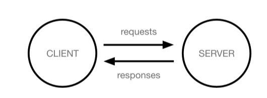

# 장고

## Framework
웹 어플리케이션을 빠르게 개발 할 수있도록 도와주는 도구
개발에 필요한 기본 구조, 규칙, 라이브러리 제공

### 왜 사용할까?
개발 속도 증가
유지보수 용의 품질 증가

## djange
python 기반의 대표적인 웹 프레임워크

## 크라이언트와 서버
### 웹 동장방식

#### Client
서비스를 요청하는 주체
(웹 사용자의 인터넷 연결된 장치)

#### Server
클라이언트의 요청에 응답하는 주체

#### django를 이용해 서버를 구현할 예정


## django 프로젝트 및 가상환경
### 가상환경
- 의존성의 관리
- 팀 프로젝트 협업 : 모두 동일한 환경에서 충돌 방지
글로벌 안에 독립적인 환경(매번 만듦)
```Bash
# 가상환경을 만든다
python -m venv venv
# 가상환경 활성화
source venv/Scripts/activate
# django 설치
pip install django==3.2.18
# 의존성 파일 생성
pip freeze > requirements.txt
# django 프로젝트 생성
django-admin startproject firstpjt .
# dhango 서버 실행
python manage.py runserver
#서버와의 연결을 위해 URL을 켜준다
# 끄기
crtl + c
deactivate


# 내가 깃 받았을때 패키지 설치
python -m venv venv
pip install -r requirements.txt
```

### LTS(long-term support)
기업이나 대규모 프로젝트에서 소프트 웨어 업그레이드에 많은 비용과 시간이 필요하기 때문에 안정적이고 장기간 지원되는 버전이 필요
---
## 참고
기본 설정을 .git ignore해야한다
[이그노어 사이트](https://www.toptal.com/developers/gitignore/)

