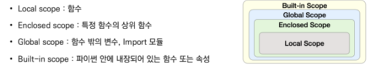

# 사용자 정의 함수
## 함수의 기본구조 [local scope에 저장]
_basis.png)
1. call & define (붕어빵 틀)
2. input (밀가루, 팥)
3. scpoe (조리)
4. output (붕어빵)

## Call & Define
`def` 활용하여 실행코드 작성하여 `return`값을 정함
paramerter를 넘겨줄 수 있음
return 값을 넘겨줌

> def foo()... retrun True

## Output
return 값이 여러개여도 제일 처음 것만 실행
return이 없다면 None
return 값을 반환하고 종료
* print와의 차이
    
    print = 출력
    return = 함수 안에서 값 반환

## Input
1. paramerter  
     함수 `실행` 시 내부함수에서 사용되는 식별 값

2. argument  
    함수 `호출` 시 넣어주는 값

    보통 위치에 따라 함수에 전달 but `변수 이름을 직접 정할 수 있음`

> def function(paramerter)... return... function(argument)

- paramerter에서 기본값을 설정 → argument 값은 설정하지 않도록 함
- *paramerter : argument를 `무한`으로 받는다(`tuple`)
- **paramerter : argument를 `dictionary`로 묶여 처리

## Scope

bulit-in scope

    파이썬 실행 이후 영원히 유지
global scope

    코드 어디에서든 참조할 수 있는 공간
    variable : global scope에서 정의된 변수
local scope
    모듈, 인터프리터가 끝날 때까지 유지

    함수가 만든 scope로 함수 내부에서만 참조 가능
    variable : local scope에서 정의된 변수
    함수 호출 시 생성 종료 시까지 유지

- 함수 내에서는 바깥 scope의 변수엔 접근 가능하나 수정은 불가
- global 문을 사용하면 내부함수에서 변경하능

---
[연습](실습/%EC%97%B0%EC%8A%B5_1.py)

