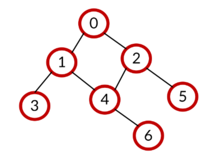
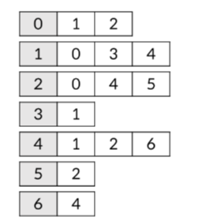

# 그래프


정점과 이를 연결하는 간선들의 집합(비선형)
## 용어
### 정점 
간선으로 연결되는 노드(역)

### 간선 
정점간의 관계 선 (기찻길)

### 경로
시작 정점부터 도착정점을 나열한 경로

### 인접 
두개의 정점이 하나의 간선으로 직접연결 된 상태 (강남-선릉)


## 종류
### 무방향 그래프
간선의 방향이 없음(양방향의 정점으로 이동 가능)

`차수(degree)` : 하나의 정점에 연결된 간선 개수

즉, 차수 = 간선수 * 2

### 유방향 그래프
간선의 방향이 있는 그래프

간선의 방향이 가리키는 정점으로 이동가능

`차수` : 진입차수 진출 차수 나뉨


## 그래프의 표현

### 인접 행렬


간선이 없으면 0, 있으면 1로 표현하는 `행렬` 방식

무조건 `메트릭스` 사용

직관적이지만 불필요한 낭비
간선이 많지만 `정점이 적을때` 사용

간선이 있을 때 바꾸는 방식
```python
 graph = [[(0)] for _ in range(접점 개수)]     
for _ in range(간선 개수):
    x, y = map(int, input().split())  
    graph[x][y] = 1
    graph[y][x] = 1
```


### 인접 리스트

`리스트`를 통해 정점의 인접 정접을 순차적으로 표현하는 방식

인덱스 번호가 정점 번호를 의미

인접 리스트 만들기
```python
graph = [[] for _ in range(정점 수)]

for _ in range(간선 수):
    x, y = map(int, input().split())
    graph[x].append(y)
    graph[y].append(x)
```
정점만 모아놔서 효율적
정점이 많지만 `간선이 적을 때` 사용


