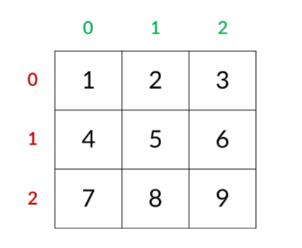

# 이차원 리스트
리스트를 원소로 가지는 리스트

행렬의 형태



## 만드는 법
### 직접 작성
> matrix = [[000], [000], ...]

### 반복문
> for _ in range(행)   
matrix.append([0] * 열)

주소 값이 같아서 하나는 변경하면 다같이 바뀐다

### 리스트 컴프리헨션
> matrix = [0] * 열 for _ in range(행) 
 주소 값이 달라 하나를 변경해도 하나만 변경된다

↔ [[0] * m] * n : 주소값이 같아 원소값을 하나 변화시킬 때 각 해당 열들이 다 바뀜


## 입력받는법
1. 행렬의 크기가 주어진 경우

    행을 이용하고 열로 입력

2. 행렬의 크기가 입력으로 주저진 경우
    행, 열 모두 이용 따로 입력


## 순회
이차원 리스트를 행렬처럼 출력

```
1 2 3 4 
5 6 7 8
9 1 2 3
```
### 인덱스를 각각 출력
```python
 print(matrix[0][0]    
.... print(matrix[2][3]))
```
### for문(행 우선 순회)
```python
for i in range(`3`):   
   for j in range(`4`):  
        print(matrix[`i`][`j`], end = "")
```

### for문(열 우선 순회)
```
1 5 9
2 6 1
3 7 2
4 8 3
```
```python
 for i in range(`4`):   
    for j in range(`3`):  
        print(matrix[`j`][`i`], end = "")
```

---
참고

총합 구하기 : sum(map(sum, matrix))


## 전치
행렬의 행과 열을 거로 맞바꾼다
```
1 5 9
2 6 1
3 7 2
4 8 3
```
```python
t_matrix = [['0'] * `3` for _ in range(`4`) ]  
 for i in range(`4`):   
    for j in range(`3`):  
        t_matrix[`i`][`j`] = matrix[`j`][`i`]
```

## 회전

왼쪽 오른쪽 90도 회전이 가능하다

### 왼쪽 회전
```
4 8 3
3 7 2 
2 6 1
1 5 9
```
```python
lr_matrix = [['0'] * `3` for _ in range(`4`) ]  
 for i in range(`4`):   
    for j in range(`3`):  
        lr_matrix[`i`][`j`] = matrix[`j`][`4 - 1 -i`]
```

### 오른쪽 회전
```
 9 5 1
 1 6 2
 2 7 3
 3 8 4
 ```
```python
rr_matrix = [['0'] * `3` for _ in range(`4`) ]  
 for i in range(`4`):   
    for j in range(`3`):  
        rr_matrix[`i`][`j`] = matrix[`3 -1 -j`][`i`]
```


---
참고

- list(zip(*matrix))
    = 열 우선 순회

- list(zip(*matrix)[::-1])
    = 오른쪽으로 회전
