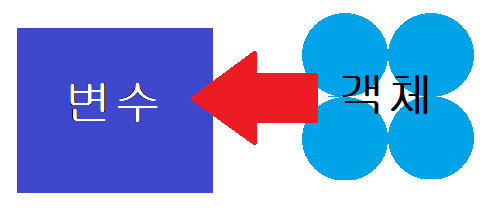

# Python이란?

## 컴퓨터 프로그래밍 언어

- 컴퓨터 : `조작`(Caculaion) + `저장`(Remember)

- 프로그래밍 : `명렁어`의 모음

- 언어 : 생각을 `문법적으로 전달`하는 말의 집합

즉, **명령어를 문법적으로 컴퓨터에게 전달하는 언어** 중 하나

## 특징
- 타언어에 비해 간단, 간결, 명료

- 다양한 운영체제에서 지원되는 크로스 플랫폼 언어

- 보기 쉬운 인터프리터 언어

- 객체로 모두 구현 되는 `객체 지향` 프로그래밍

## 객체와 변수

### 객체 (Object)
- 숫자, 문자 클래스 등의 값

### 변수 (Variable)
- `객체의 참조` 값
- type() : 객체의 타입 
    int, str...
- id() : 객체의 고유 `메모리주소`
- 다른 변수와 같은 객체를 할당 가능
    x = y = 1
- 다른 값을 동시에 할등 가능
    x, y = 1, 2
- 변수끼리 객체를 바꾸고 싶을때
     x, y = y, x

### 식별자(identilfiers)
- 객체를 식별하는데 사용하는 이름
- 길이 무관하게 영문(대소문자 구별), _, `숫자(첫글자 X)`로 구성
- 키워드, 예약어 사용 금지

## 객체 (Object) 종류
### 숫자
#### 수치형
- **int(정수)**
    
    큰 수여도 오버플로우 발생하지 않음
- **float(실수)**

    부동소수점(표기어러운 소수)로 연산 관정에서 발생가능
- **complex (복소수)**
#### 불린형(boolean type)
    True(1이상) / False (0)
    비교/논리 연산

#### 숫자형 연산자(Operator)
1. 산술 연산자

|연산|의미|
|-|-|
|+|덧셈|
|-|뺄셈|
|*|곱셈|
|/|나누기|
|%|나머지|
|//|몫|
|**| 거듭제곱|

2. 복합연산자(연산과 할당 동시에)

|연산|의미|
|-|-|
|a = a + b|a += b|
|a = a - b|a -= b|
|a = a * b|a *= b|
|a = a / b|a /= b|
|a = a // b|a //= b|
|a = a % b|a %= b|
|a = a ** b|a **= b|

3. 비교연산자

|연산|의미|
|-|-|
|<|미만|
|<=|이하|
|>|초과|
|>=|이상|
|==|같다|
|!=|같지않다|

4. 논리연산자

|연산|의미|
|-|-|
|A and B|A,B 모두 True여야 True|
|A or B|A, B 둘 중 하나가 True이면 True|
|Not|True랑 False가 반대로 출력|

### 시퀀스(sequence)(순서 有)
- **str(문자형)** : `문자` 나열

|부호|의미|
|-|-|
|\n|엔터|
|\t|tab(탭)|
|\r|캐리지리턴|
|\0|Null|
|`\\`|`\`|
|\'|작은 따옴표 하나|
|\"|큰 따옴표 하나|

- tuple(튜플) : ``변경 불가능``한 값 나열
                반복가능, ()형태로 작성

- **list(리스트)** : `변경 가능한 값` 나열
    - .append() : 리스트에 추가
    - .pop() : 리스트에서 삭제

- **range(범위)** : 숫자 나열

    range(4) == [0,4] == [0,1,2,3]
    range(0, -6 , -1) == [0, -,...-5]
    range(0,5,2)[::-1] == [4. 2, 0]
#### 시퀀스형 공통 연산자

|연산|결과|
|---|---|
|s[i]|s의 i번째 값, 0부터 시작한다|
|s[i:j]|s의 i에서 j 미만 까지|
|s[i:j:k]|s의 i에서 j 미만 까지, 스텝 k만큼 점프|
|s + t|문자 s와 문자 t를 ``띄어쓰기 없이 붙일`` 수 있음|
|s * n or n * s|문자s, 숫자n을 곱하면 n만큼 문자s가 출력됨|
|x in s|s 중 하나에 x가 있으면 True|
|x not in s|s 중 하나에 x가 있으면 False|
|len(s)|s의 길이|
|min(s)|s의 가장 작은 값|
|max(s)|s의 가장 큰 항목|

    
### 컬렉션(collection) (순서 無)
- set(집합) : 유일한 값 모음 (`순서`, 중복 `없음`)
            변경 반복 가능
            a= () or {}  a=set()
    - all
    - remove

- dictionary(딕셔너리) : 키-값 모음

### None
- 값없음

## 입출력
* print() : 출력함
* input() : 사용자한테 값을 받음
---
## 주의사항
- 대소문자 구분
- 띄어쓰기, 문장부호
- 들여쓰기
- `통일성`이 제일 중요

## 추가
- crtl + / : 주석
- clear : 터미널 지우기
- `= : 객체를 변수에 할당할 때 사용`
- 시퀀스형 연산자의 시작은 `0부터` 음수는 뒤에서 `-1부터`

|객체1|객체2|객체3|객체4|객체5|
|-|-|-|-|-|
|0|1|2|3|4|
|-5|-4|-3|-2|-1|

- f-string을 사용하면 알아서 문자를 분리해준다.
    > print(f'저의 이름은 {a}이고, 올해 나이는 {c}세 입니다.')

---
실습자료 

[실습1](python/%EC%8B%A4%EC%8A%B51.py)
