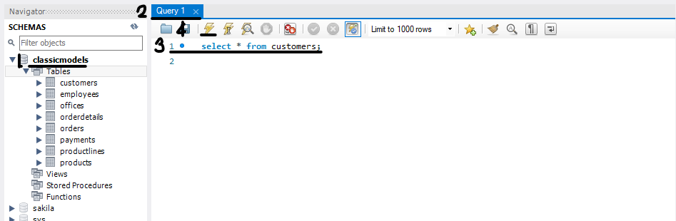

1. Workbench 활용 MySQL 접속 방법

`workbench`로 들어간다

→ `Local intance`를 클릭

→ password를 치고 들어감

2. 데이터베이스 추가
`Data Import`로 파일을 가져온다

→ 하단의 `Schemas` 클릭

→ 새로고침해서 데이터 베이스가 들어왔는지 확인

3. 실습 데이터베이스에 대한 쿼리(Query)문 작성 및 쿼리문 실행 방법

원하는 데이터 베이스를 선택

→ 상단에 열린 `Query`에디터를 클릭

→ 숫자 옆에 쿼리문을 입력

→ 위에 번개모양을 클릭하여 쿼리문 실행

