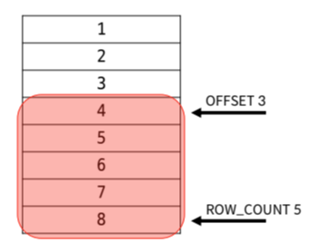

# SQL 1개의 테이블 - Filter data
## DQL(검색/조회)
### 3. Filter data

#### ◆ DISTISNT stntax

중복 제거
무조건 **select 뒤에 작성**

```SQL
SELECT DISTINCT
```

Q. 테이블 employees에서 *중복 없이* lastName 조회

```SQL
SELECT DISTINCT
	lastName
FROM 
	employees
ORDER BY 
	lastName;
```


#### ◆ WHERE syntax

조회 시 **특정 검생 조건**을 지정
**FROM 뒤에 작성**
```sql
SELECT
    select_list
From
    table_name
WHERE
    search_condition
```

Q. 테이블 employees에서 officeCode *필드 값이 1*인 데이터의의 lastName, firstName, officeCode 조회
```sql
SELECT 
	lastName, firstName, officeCode
FROM
	employees
WHERE
	officeCode = 1;
```

Q. 테이블 employees에서 jobTitle 필드 값이 "Sales Rep"이 *아닌 데이터의* lastName, firstName, jobTitle 조회
```sql
SELECT 
	lastName, firstName, jobTitle
FROM
	employees
WHERE
	jobTitle != "Sales Rep"
```


Q. 테이블 employees에서 jobTitle 필드 값이 "*Sales Rep"면서 officeCode가 3이상*인 데이터의의 lastName, firstName, officeCode, jobTitle 조회
```sql
SELECT 
	lastName, firstName, officeCode, jobTitle
FROM
	employees
WHERE
	officeCode >= 3 AND
    jobTitle = "Sales Rep";
```

Q. 테이블 employees에서 jobTitle 필드 값이 "Sales Rep" *아니면서 officeCode가 5미만인* 데이터의의 lastName, firstName, officeCode, jobTitle 조회
```sql
SELECT 
	lastName, firstName, officeCode, jobTitle
FROM
	employees
WHERE
	officeCode < 5
    OR
    jobTitle != "Sales Rep";
```

Q. 테이블 employees에서 officeCode 필드 값이 *1에서 4인 데이터*의 lastName, firstName, officeCode 조회
```sql
SELECT
	lastName, firstName, officeCode
FROM 
	employees
WHERE
	officeCode BETWEEN 1 AND 4;
```
* `BETWEEN` : ~사이에 


Q. 테이블 employees에서 officeCode 필드 값이 1에서 4인 데이터의 *officeCode 오름차순*으로 lastName, firstName, officeCode 조회

```sql
SELECT
	lastName, firstName, officeCode
FROM 
	employees
WHERE
	officeCode BETWEEN 1 AND 4
ORDER BY
	officeCode;
```
* `ORDER BY는 WHERE 뒤에 적는다`


Q.테이블 employees에서 officeCode 필드 값이 *1 혹은 3 혹은 4*인 데이터의 lastName, firstName, officeCode 조회

```sql
SELECT
	lastName, firstName, officeCode
FROM
	employees
WHERE
	officeCode IN (1, 3, 4);
```


Q.테이블 employees에서 officeCode 필드 값이 *1 혹은 3 혹은 4이 아닌* 데이터의 lastName, firstName, officeCode 조회

```sql
SELECT
	lastName, firstName, officeCode
FROM
	employees
WHERE
	officeCode NOT IN (1, 3, 4);
```

Q. 테이블 employees에서 lastName이 *"son"으로 끝나는 데이터*의 lastName, firstName 조회
```sql
SELECT
	lastName, firstName
FROM
	employees
WHERE
	lastName LIKE "%son";
```
* 와일드 카드
    
    '%` : `0개 이상`의 문자열과 `일치` 하는지
        

    `_` : `단일 문자`와 일치 하는지

* `Like` 와일드 카드

    특정 패턴(와일드 카드)에 일치하는 값 을 찾음

> 전화 번호라면 like "__%-95__-%___"


Q. 테이블 employees에서 firstName이 *4글자이면서 y로 끝나는 데이터*의 lastName, firstName 조회
```sql
SELECT
	lastName, firstName
FROM 
	employees
WHERE
    firstName LIKE "___y";
```


#### ◆ LIMIT syntax
**하나 ~ 두개의 인자를 사용**


`row_count` : **조회할** 최대 레코드 수

`offset` : 시작점(**건너뛸** 순위)
```sql
SELECT
    select_list
From
    table_name
LIMIT [offset,] row_count
-- 4 ~ 8
-- LIMIT 3, 5
```

Q. 테이블 employees에서 	officeCode를 *내림차순으로 7개의 데이터*의 firstName, officeCode 조회
```sql
SELECT
	firstName, officeCode
FROM
	employees
ORDER BY
	officeCode DESC
LIMIT 7;
```

Q. 테이블 employees에서 	officeCode를 *내림차순으로 4부터 8까지의 데이터*의 firstName, officeCode 조회
```sql
SELECT
	firstName, officeCode
FROM
	employees
ORDER BY
	officeCode DESC
LIMIT 3, 5;
```


#### ◆ GROOUP BY clause
레코드는 **그룹화**하여 **요약본**을 생성
with **집계함수**

- 집계함수(aggregation functions) 

   : 값에 대한 계산을 수행하여 단일 값을 반환하는 함수

```sql
SELECT
    c1, c2..cn, aggregate_function(ci)
From
    table_name
GROUP BY
    c1, c2..cn;
```


Q. 테이블 customers에서 country 필드로 그룹화하여  *creditLimit의 평균 값을 내림차순*으로 country, creditLimit의 평균 값 조회
```sql
SELECT
	country,
    AVG(creditLimit) AS avgOfCreditLimit
FROM 
	customers
GROUP BY
    country
ORDER BY
	avgOfCreditLimit DESC;
```


Q. 테이블 customers에서 country 필드로 그룹화하여  *creditLimit의 평균 값이 80000* country, creditLimit의 평균 값 조회
```sql
SELECT
	country,
    AVG(creditLimit)
FROM
	customers
-- WHERE
-- 	AVG(creditLimit) > 800000
-- group by 안의 조건은 where이 아닌 Having
GROUP BY
	country
HAVING
	AVG(creditLimit) > 80000;
```
* HAVING

    : 집계 항목에 대한 세부조건 지정
    (= GROUP BY에 WHEREE)


### 배운 연산자  정리
1. Logical Operators(논리 연산자)

    :   AND(&&), OR(||), NOT(!), IN, LIKE

2. Comparison Operator(비교연산자)

    : =, >=, <=, !=, IS, LIKE, IN, BETWEEM, ... AND

3. Wildcard Characters

    : %, _

* SELECT statement 실행 순서
```
From
Where
Group By
Having
Select
Order by
Limit
```
---
참고

#### 정렬에서의 NULL
오름차 정렬시 가장 먼져 나옴(가장 작다)

빼고싶다면?
> WHERE     
    필드 IS NOT NULL

