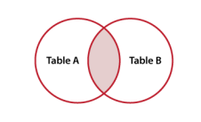
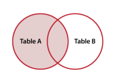
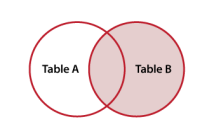

# SQL Mulyi table queries
## 학습목표
- 두 개 이상의 테이블간의 관계를 파악할 수 있다.
- 두 개 이상의 테이블에서 조합하고 관계를 만들기 위한 기준 필드를 정할 수 있다.
- JOIN 구문을 사용하여 두 개 이상의 테이블을 조합하고 관계를 만드는 쿼리문을 작성할 수 있다.

# join 이란?
여러 테이블 간의 관계 & 연결

여러 테이블을 나누어 저장하고 결합하여 출력

다른 테이블과 연결짓는게 필요

## join table

둘 이상의 테이블에서 테이블을 검색하는 방법

### join의 종류
```
INNER JOIN

OUTER JOIN

    LEFT JOIN
    RINGT JOIN

CROSS JOIN
```

### INNER JOIN

```sql
SELECT
    select_list
FROM
    table1
INNER JOIN table2
    ON table1.fk = table2.pk
```
From 절 이후 메인 테이블 지정(table1)

Inner 메인 테이블과 조인할 테이블 지정(table2)

ON 키워드 이후 조인 조건 지정

---

Q. productLine 값이 같은 레코드의 productCode, productName, textDescription 조회
```sql
SELECT productCode, productName, textDescription
FROM products
INNER JOIN productlines
    ON products.productLine = productlines.productLine;
```

Q. *orderNumber가 같은* 레코드의 orderNumber, status, priceEach 조회
```sql
SELECT orders.orderNumber, status, priceEach
FROM orders
INNER JOIN orderdetails
    ON orders.orderNumber = orderdetails.orderNumber;
```

Q.orderNumber가 같은 레코드를 *주문번호 별로* orderNumber, status, SUM(priceEach * quantityOrdered) AS totalSales 조회 
```sql
SELECT orders.orderNumber, status, SUM(priceEach * quantityOrdered) AS totalSales
FROM orders
INNER JOIN orderdetails
    ON orders.orderNumber = orderdetails.orderNumber
GROUP BY  orders.orderNumber;
```


### LEFT JOIN


```sql
SELECT
    select_list
FROM
    table1
LEFT JOIN table2
    ON table1.fk = table2.pk
```
table1은 모두출력

table2은 table1과 같은것 외는 NULL

한 테이블에 매칭이 되는게 여러개라면 여러개 출력

---

Q. customers 기준으로 customerNumber와 일치하는 레코드의 contactFirstName, orderNumber, status를 출력
(*일치하지 않는경우 NULL*)
```sql
SELECT contactFirstName, orderNumber, status
FROM customers
LEFT JOIN orders
	ON customers.customerNumber = orders.customerNumber;
```

Q. 직전 조회결과를 바탕으로 주문하지 않는 고객의 이름
```sql
SELECT contactFirstName, orderNumber, status
FROM customers
LEFT JOIN orders
	ON customers.customerNumber = orders.customerNumber
WHERE orderNumber IS NULL;
```


### RIGHT JOIN


```sql
SELECT
    select_list
FROM
    table1
RIGHT JOIN table2
    ON table1.fk = table2.pk
```

---

Q. customers 기준으로 employees에서 
salesRepEmployeeNumber와 employeeNumber 같은 레코드의 employeeNumber, firstName, customerName, contactFirstName 출력
```sql
SELECT employeeNumber, firstName, customerName, contactFirstName
FROM customers
RIGHT JOIN employees
	ON customers.salesRepEmployeeNumber = employees.employeeNumber;
```

Q. 위를 기준으로 판매하지 못한 판매자의 이름을 출력
```sql
SELECT employeeNumber, firstName, customerName, contactFirstName
FROM customers
RIGHT JOIN employees
	ON customers.salesRepEmployeeNumber = employees.employeeNumber
WHERE customerNumber IS NULL;
```
