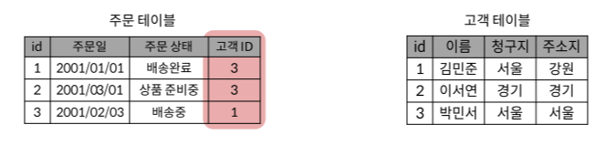

# Relation

## 학습 목표
- 데이터베이스 상의 관계 정의
- 관계형 데이터 베이스 용어 역학 & 특징
- DBMS의 정의와 영할

## 관계형 데이터 베이스
데이터 간 `관계`가 있는 데이터 항목의 모음

 

- **관계** : 여러 테이블 간의 연결 (id)

`서로 관련된 데이터 포인트`를 저장 & 이에 대한 `액세스 제공`

- 기본기(PK) = 서로 관련된 데이터 포인트 (id)

- 외래키(FK) = 기본키 바탕으로 비교대항을 구별해 주는 키(관계를 만들어 준다) (고객ID)

### 관계형 데이터베이스 용어
1. **Table(Relation)**
    
    : 데이터를 기록하는 곳(표)

    (주문테이블, 고객테이블)

2. Field(Column, Attribute)
    
    : 고유한 데이터 형식(타입)

    (id, 이름, 청구지...)

3. Record(Row, Tuple)

    : 구체적인 테이터 값

    (1, 김민준, 서울, 강원....)

4. Database(Schema)

    : 테이블의 집합

5. **Primary key**

    : 각 레코드의 고유의 값

    관계형 데이터베이스에서 `레코드 식별자`로 황용

6. **Foreign Key**

    : 다른 테이블 레코드를 식별할 수 있는 키

    각 레코드 간의 `관계를 만드는 데` 사용

## RDBMS
**R**elation
**D**ata
**B**ase
**M**anagment
**S**ystem

: 관계형 데이터 베이스를 관리하는 소프트웨어 프로그램

### MySQL의 구조

Database Server(MYSQL) > Database > Table
