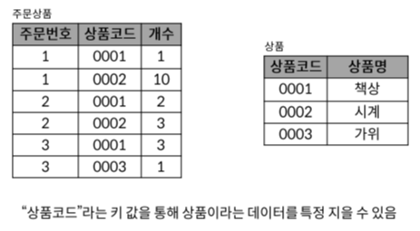
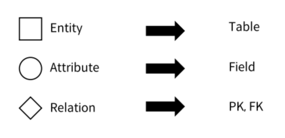
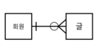

# 09-01 SQL Advanced.md
## Noramlization(정규화)
RDB 설계 단계에서 중복을 최소화하여 데이터를 **구조화**하는 과정

### 제 1 정규화

1. 데이터베이스의 각 필드에는 하나의 값만 저장해야 함
2. **유사하게 정보를 저장하는 두개의 필드가 있어성는 안됨**
    (반복되는 부분은 찾아 테이브를 분할하고 기본키가 될 필드를 저장)

### 제 2 정규화

**키 값을 이용해 데이터를 특정** 지을 수 있는 것(**함수 종속성**)을 찾아 테이블 분할

### 제 3 정규화

기본 키 이외의 부분에서 **중복**이 없는 지 조사하여 테이블 분할

### 목적
> 데이터를 쉽게 관리
- 하나의 데이터는 한곳에 위치
- 테이블 간 관계는 키를 통해 형성
- 데이커를 변경하더라도 한 곡만 변경하는 구조

## Data Modeling
데이터베이스 시스템을 시각적으로 표현하는 프로세스
→ 데이터 유형, 관계 및 분석 등을 통해 비즈니스 요구사항을 만들어 낼 수 있도록 도움

### ER(entity-relationship) Diagram
데이터 베이스의 요소의 관계를 나타내는 다이어그램
#### 구성요소

#### 예시

#### relationship 표현 방법
cardinality(기수) & optionality(선택)

##### cardinality

1:1 관계
각 회원은 글 하나만 쓸수 있다

1:N 관계
각 회원글이 여러개
(FK키 발생)

M:N 관계
각 글의 여러 회원이 존재

#### optionality

1:N 관계라면 회원은 "필수" & 글 "선택"

#### 중요성
- 데이터베이스 소프트웨어 개발 오류 감소
- 데이터베이스 설계 및 생성 속도와 효율성 촉진
- 조직 전체에서 데이터 문서화 및 시스템 설계의 일관성 조성
- 데이터 엔지니어와 비즈니스팀 산의 커뮤니케이션 촉진

---
#### ERD 작성 사이트

[ERDCloud](https://www.erdcloud.com/)

[diagrams](https://app.diagrams.net/)