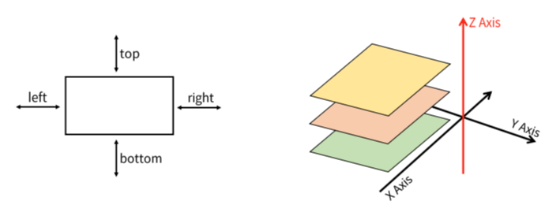

# Positioning for CSS layout

## 개요
CSS Layout
각 요소의 위치와 크기를 조정하여 웹 페이지 디자인을 결정하는 것
→ 다른 요소 위에 높기, 특정 부분에 고정

## CSS position(포지션)
Normal Flow에서 요소를 끄집어 내서 다른 위치로 배치하는 것

### 이동방향



### [유형](01.html)
#### static (기본)
- 기본값
- normal flow에 따라 배치

#### relative (상대)
- normal flow에 따라 배치
- 자기 자신을 기준으로 이동
- 요소가 차기하는 공간은 static와 같음

#### absolute (절대적)
- 요소를 normal flow에서 제거
- 가장 가까운 relative 부모 요소를 기준으로 이동
- 문서에서 요소가 차지하는 공간이 없어짐

#### fixed (고정적)
- normal flow에서 제거
- 현제 화면 영역(viewport)을 기준으로 이동
- 문서에서 차지하는 공간이 없음

#### [sticky(메모)](01-2.html)
- normal flow에 따라 배치
- 가장 가까운 block 부모 요소 기준으로 이동
- 요소가 특정 임계점에 스크롤 될 때 그 위치에 고정(다음 sticky 요소가 있다면, 그 자리를 대체)

### [z-index](01-3.html)
요소가 겹쳤을때 어떤 요소를 우선 출력된지 Z축으로 나타냄

작을수록 뒤로간다(음수 가능)

---
## 참고
### transform
```html
trensform : translate()....
```
요소에 회전, 크기조절, 기울기, 이동 효과 등을 부여
#### 자주쓰는 값
- translate(x, y) : 특정 방향으로 이동
    -- -+
    +- ++ 의 방향으로 이동한다.

- scale () : 확대한다

- rotate(0.5turn) : 일정방향으로 회전한다


[box_sizing](https://developer.mozilla.org/ko/docs/Web/CSS/box-sizing)
 : 모 박스에 맞게 자 박스를 맞는 사이즈로 출력하게 해주는 기때문에 꼭 설정!
