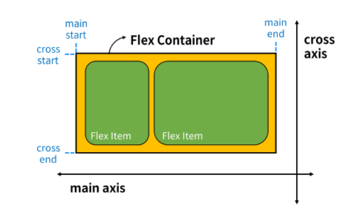

# flexbox
요소를 행과 열 형태로 배치하는 1차원 레이아웃 방식

요소 간의 **공간 배열과 정렬**

## 기본 사항

- Main (주 축)
    
    : flex time들의 배치가 되는 기본 축

    main start ~ end (좌우)

- Cross axis(교차축) 

    : main에서 수직인 축 (가로 세로 아님)

    cross start~end (상~하)

- Flex Container
    : display : flex혹은 inline-flex; 가 설정

- Flex Item
    : flex 안에서 정리가 되는 요소

## Flexbox 레이아웃 구성

### 속성

#### 1. [Flex Conrainer 속성](02.html)
1. flex container 지정
    
    : flex item은 행으로 나열
    flex item은 주축의 시작 선에서 시작
    
    flex item은 교차출의 크기를 채우기 위해 늘어남

2. flex-direction 지정
    
    : flex item 나열되는 방향 지정
    column으로 주축 변경 가능
    
    -reverse로 지정하면 시작 선과 끝 선이 서로 바뀜

3. [flex-wrap](05.html)

    : flex-item 목록이 flex container의 하나행에 들어가지 않을 경우 다른행으로 변경할 지 여부

4. justify-content

    : 주 축에 따라 flex item 공간 분배

    center, end, start, space-between, space-around...

5. align-content
    
    : 교차 축을 따라 flex item과 주위에 공간을 분배

    flex-wrap이 wrap또는 wrap-reverse로 설정된 행만 적용 됨

    한줄짜리 행에는 효과 없음

6. align-items
    
    : 교차 축을 따라 flex time 행을 정렬

7. align-self
    
    : 교차 축을 따라 개별 flex item을 정렬

8. [flex-grow](03.html)

    : 남는 행 여백을 비율에 따라 각 flex item에 분배

    ↔ flex-shrink

9. [flex-basis](04.html)
    
    : flex item의 초기 크기 값을 지정

---

#### 2. Flex item 속성
