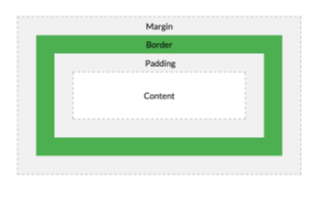

# The box model
## 개요
CSS Box Model : 모든 HTML요소를 박스로 표현

## [구성요소](02-1.html)
### CSS Box Model
- 크기, 여백, 테두리..

- Margin : 다른 박스와의 공백(가장 바깥쪽)
- Border : 콘텐츠와 패딩을 감싸는 테두리
- padding : 콘텐츠 주위에 위치하는 공백
- content : 콘텐추가 표시되는 영역

### width & height속성
요소의 너비&높이 지정
이때 콘텐츠 영역을 기준으로 함

### [box-sizing](02-2.html)
요소의 너비& 높이 계산 방법을 지정
- border-box
- content-box

## [박스타입](02-3.html)
### block & inline
#### block 
**위에서 아래**로 흐름
자신이 공간을 다 차지하지 못해도 마진을 꽉 채움
- 항상 새로운 행으로 나뉨
- width & height 지정 가능
- width 공간은 모두 차지함
- h1~6, p, div 

#### lnline 
**좌에서 우**로 흐름
- 새로운 행으로 나뉘지 않는다
- width & height 속성을 사용할 수 없다 (**img 제외**)
- 수직 방향으론 밀어 낼 수 없지만 수평방항으론 밀어낼 수 있다.
- a, img, span

---
참고

shorthand 속성(margin & padding 지정)
- 4개 : 상/우/하/좌
- 3개 : 상/좌우/하
- 2개 : 상하/좌우
- 1개 : 공통

display: inline-block
- inline과 block 요소 사이의 중간 지점을 제공하는 display값
- 요소가 **줄 바꿈이 되는것을 원치 않으**면서 **너비와 높이를 지정**하고 싶은 경우 
- block요소의 특징을 가짐

margin collapsing(마진 상쇄)
- 둘 다 **블락**이면서 **상하 관계**에서 마진이 겹치는 경우 **큰값으로 상쇄**
- 10/30 => 30