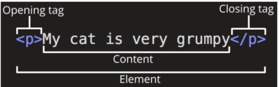

# web_fundamentals_of_HTML_and_CSS

## 학습목표
- HTML의 기본 구조와 문법을 이해하고 웹 페이지를 작성할 수 있다.
- CSS 기본 구조와 문법을 이해하고, 작성할 수 있다.
- HTML 요소에 대해 스타일을 작성할 수 있다.

## 1. 웹페이지란?
### WWW(world wide web) 
: 인테넷에서 여러개의 웹페이지가 모인 것

### 웹 페이지
HTML : structure
CSS : styling
javascript : behaviour

## 2. 웹 구조
### HTML
웹페이지의 구조를 만드는 언어
Hypertext + Markup Language

#### Hypertext
웹 페이지를 다른 페이지로 연결하는 **링크**

#### Markup Language
태그 등을 이용하여 문서나 데이터의 **구조를 명시하는 언어**
(HTML, Markdown)

### HTML 구조

- 하나의 요소를 `여는 태그` `닫는 태그` 안에 `내용`으로 구성
- 닫는 태그는 / 포함  but 없는 것도 있음(내용이 없는 경우)


#### HTML 속성

- 규칙

1. 요소 이름 다음 바로 오는 속성은 요소의 **이름과 속성 사이에 공백**이 있어야함
2. 하나 이상 **속성들이** 있는경우 속성사잉에 **공백으로 구분함**
3. 속성 값을 열고 닫을 때 **따옴표**로 감싸야함

- 목적
1. **나타내고 싶지 않지만 추가적인 기능, 내용**을 담고 싶을 때 사용
2. CSS가 해당 요소을 선택하기 위한 값으로 활용

#### HTML 구조
1
```html
<!DOCTYPE html>
```
 : 해당 문서가 html의 문서라는 것을 나타냄

2
 ```html
<html></html>
```
: 전체 페이지의 콘텐츠를 포함

3
 ```html
<title></title>
```
브라우저 탭 및 즐겨찾기 시 표시되는 제목으로 사용

4
 ```html
<head></head>
```
설정, 설명 등

사용자에게 보이지 않음

5
 ```html
<body></body>
```
페이지에 **표시되는** 모든 콘텐츠


#### HTML TEXT
Heading & paragraps : `<H></H>`

List : 
    `<ol></ol>` : 순서 있는 목록 
    `<ul></ul>` : 순서 없는 목록
    `<li></li>` : 리스트 항목

Emphasis & Importance : em, strong


## [3. 스타일링](01.HTML)

### CSS(cascading style sheet)
: 웹 페이지의 디자인과 레이아웃을 구성하는 언어

### CSS 구문
```HTML
문장 끝날 때 ; 주위!
h1(선택자){
    color : blue;(선언)
    font-size(속성) : 15px;(값)
}
```

**선택자는 다양하게 설정 가는**


### 적용방법
1. 인라인 스타일
body 태그의 속성으로 들어감
style

2. 내부 작성 스타일
head에다가 style태그로 작성
외부에서 보이지 얺음

3. 외부 스타일 시트
head에다가 link로 외부으 별도의 css파일을 생성 후 불러 오기


### 선택자를 선택하는 방법
CSS Selector
#### 1. 기본 선택자

1. 전체(*) 선택자

2. 요소 선택자 
: 지정한 모든 태크

3. 클래스 선택자
: 주어진 클래스 속성을 가진 모든 요소 
> .index class ="index"

4. 아이디 선택자
: 주어진 아이디 속성을 가진 요소 선택(하나만 적용!)
> #index id= "index"

#### 2. 결합자
    
1. 자손 결합자
```html
.green > span {
            font-size: 50px;
        }
```

2. 자식 결합자
```html
.green li {
    color: brown;
}
```


### [우선순위](01-2.HTML)
#### cascade(계단식)
우선순위가 같는다면 후에 나오는 규칙을 적용

#### specificity(우선순위)
우선순위 점수에따라 더 높은 규칙이 적용


#### 우선순위 높은순?
1. !important(안 씀)
```html
  <style>
        * {
            color: red !important;
        }
```
2. 인라인 → id → clasee →  요소 선택자 →  소스코드 순서

→  인라인과 !important는 거의 안쓴다

### 상송
부모 요소에 속성을 적용하면 자식에게 상속함
코드의 재사용성을 높임

#### 상송 되는 애들
text 관련요소

#### 안되는 요소
배치에 관련된 요소
---
참고
- 대소문자를 구분 하지 않지만 **소문자** 권장
- 따옴표를 구분하지 않지만 **큰 따옴표** 권장
- HTML은 에러가 없어서 작성 주위(이상한 결과 도출)
- 우선순위와 유지보수때문에 **class사용**을 권장
- 상속 여부는 MDN 여부를 확인(**css select mdn 검색**)