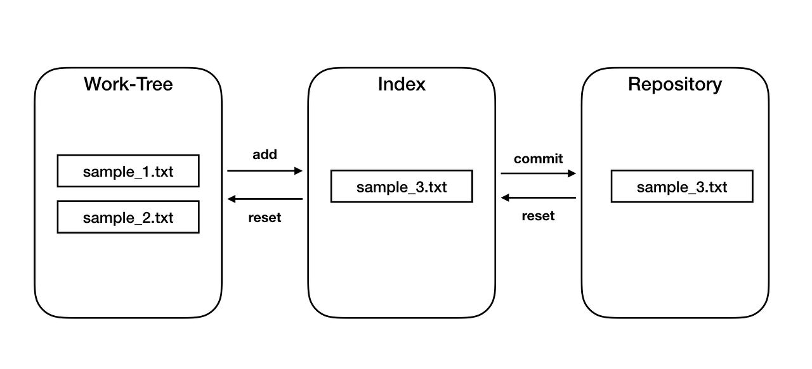

# GIT
## 정의

* 분산버전의관리 시스텀

    각 로컬(컴퓨터)에서 원격저장소를 활용하여 비전관리를 기록
         
         <->중앙집중비전관리시스탬 : 중앙 서버에서 모두 관리하고 편집

* 파일의 변경사항을 추척 & 사용자들 간의 작업 조율

* 변경사항이 없는 파일은 새로 저장할 필요 없다.


## 단계


1. working tree (작업 상태)

2. staging are (add)

3. repository (commit) 


## ★사용방법 및 작업방법
 1. git init (필수) 
    ```
     git으로 관리할 것을 알리는 신호.
     코드를 치면 working tree 내용이 자동으로 들어온다.
     ```

2. git add 파일명
    ```
    working tree에서 staging area로 넘어오게 해주는 코드
    변경파일을 모으는 과정이다.
    ```

3. git commit -m "내용"
    ```
    staging area에서 respository로 넘기는 코드
    내용을 변경하고 버전을 남기는 과정이다.
    변경사항을 파악할 수 있도록 명확히 작성
    # git commit만 했다면 내용작성 후 → Esc → :wq
    ```

4. git statue
    ``` 
    git의 현재 상태를 보여주는 코드
    staging area에 있는 내용들을 확인할 수 있다.
    ```

5. git log

    ```
    git의 commit 된 상태를 보여주는 코드
    git log oneline으로 축약해서 볼 수 있다.
    너무 길면 나오는 오류상황엔 Q를 누른다.
    commit : 해쉬값(고유번호)
    ```

## 오류 상황

### Tracked 
>이미 working tree에 있는 파일

- Unmodified : add가 필요한 상태(내용 변경)

- modified : add가 필요한 상태

- Staged : commit이 필요한 상태

### Untracked
> 없었던 새로운 파일을 만든 상태 (add 필요)


---

## 파일작업의 4가지 방법?
**C** 생성

**R** 읽고

**U** 생산

**D** 삭제

## 추가 주의사항
* .git의 폴더를 건들이지 않는다면 해당 폴더(ex. TIL)의 이름을 바꿔도 된다.
    But, git이 이미 있는 폴더에 넣으면 안된다.


